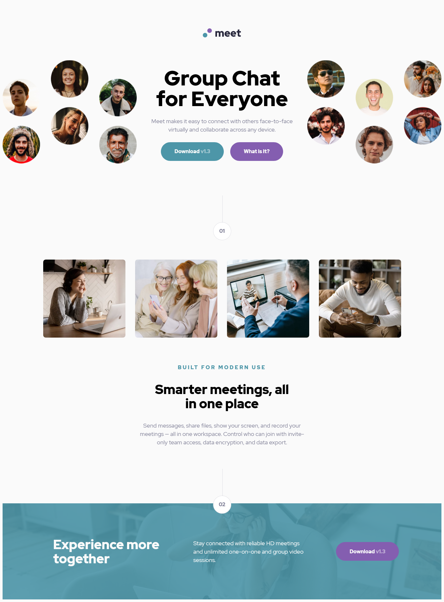

# Frontend Mentor - Meet landing page solution

This is a solution to the [Meet landing page challenge on Frontend Mentor](https://www.frontendmentor.io/challenges/meet-landing-page-rbTDS6OUR). Frontend Mentor challenges help you improve your coding skills by building realistic projects.

## Table of contents

- [Overview](#overview)

- [The challenge](#the-challenge)

- [Screenshot](#screenshot)

- [Links](#links)

- [My process](#my-process)

- [Built with](#built-with)

- [What I learned](#what-i-learned)

- [Author](#author)

## Overview

### The challenge

Users should be able to:

- View the optimal layout depending on their device's screen size

- See hover states for interactive elements

### Screenshot

### Links

- Solution URL: [https://www.frontendmentor.io/challenges/meet-landing-page-rbTDS6OUR/hub/meet-landing-page-RGHPyoFel](https://www.frontendmentor.io/challenges/meet-landing-page-rbTDS6OUR/hub/meet-landing-page-RGHPyoFel)

- Live Site URL: [https://lumensum.github.io/FEM-Meet-landing-page/](https://lumensum.github.io/FEM-Meet-landing-page/)

## My process

### Built with

- HTML

- CSS

- Flexbox

- Grid

### What I learned

Changing the view for the differenct devices in order to be responsive turned out to be a challenge regarding the hero image(s). In the end I found a solution that looks good. Initially I used an HTML img-tag in the index.html, but changed that to using a background-image in CSS in order to change it depending on the screensize of the viewer.

## Author

- Frontend Mentor - [@royschrauwen](https://www.frontendmentor.io/profile/royschrauwen)

- Twitter - [@royschrauwen](https://www.twitter.com/royschrauwen)
